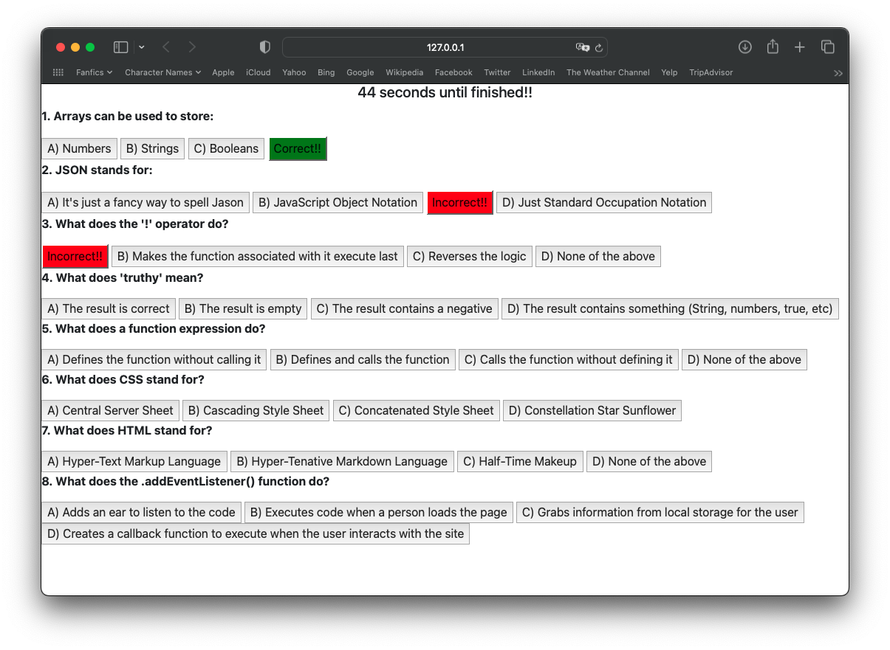
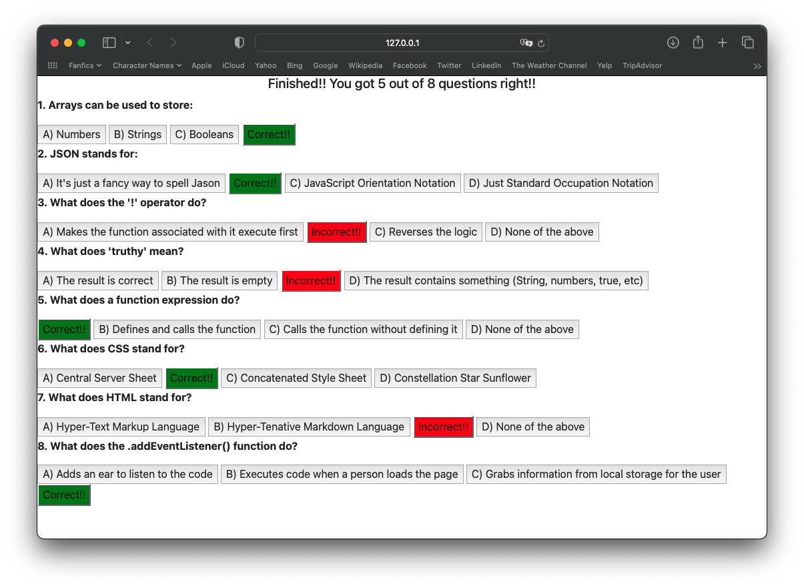
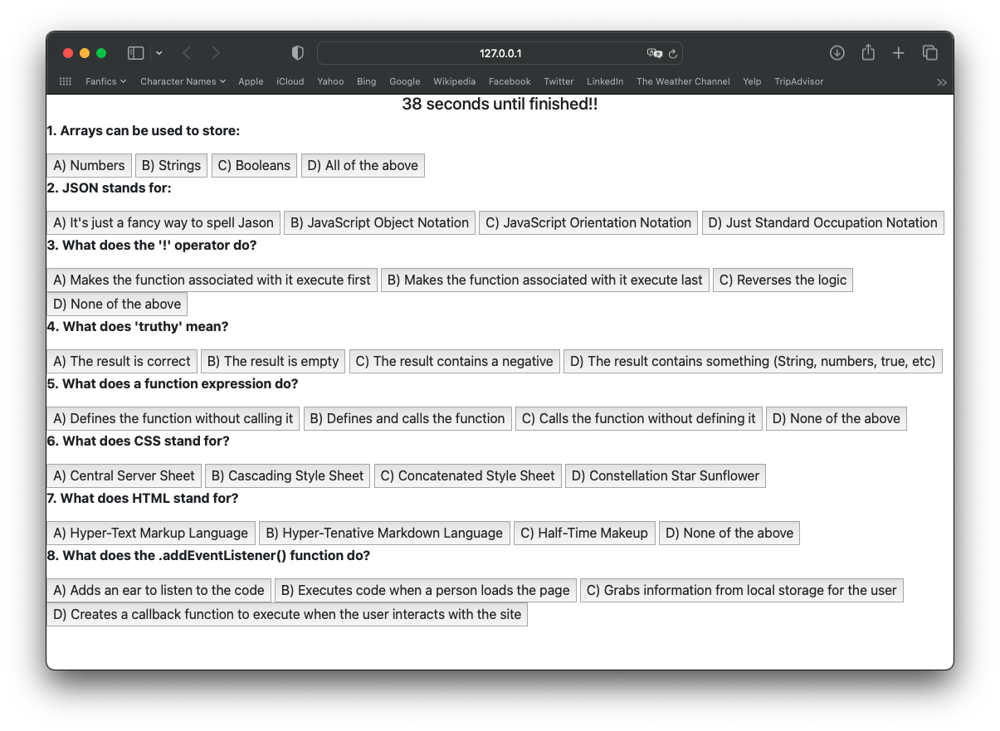

# Timed-Coding-Quiz

## Description
This website allows coding students to participate in a timed coding quiz to test their coding knowledge. After clicking on an answer, participants will be told whether their answer is correct or incorrect. With every correct answer, their score goes up.

## Installation
This webpage is accessible at 

## License
Licensed under the MIT License
